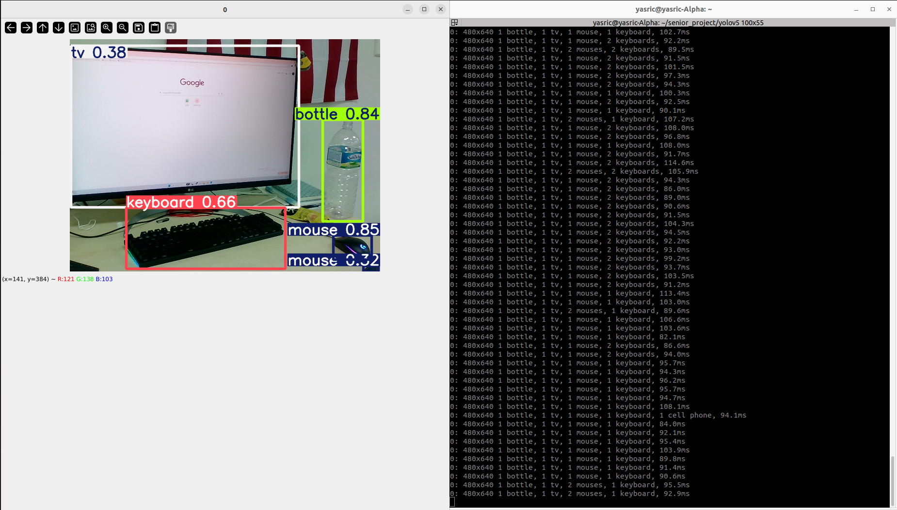
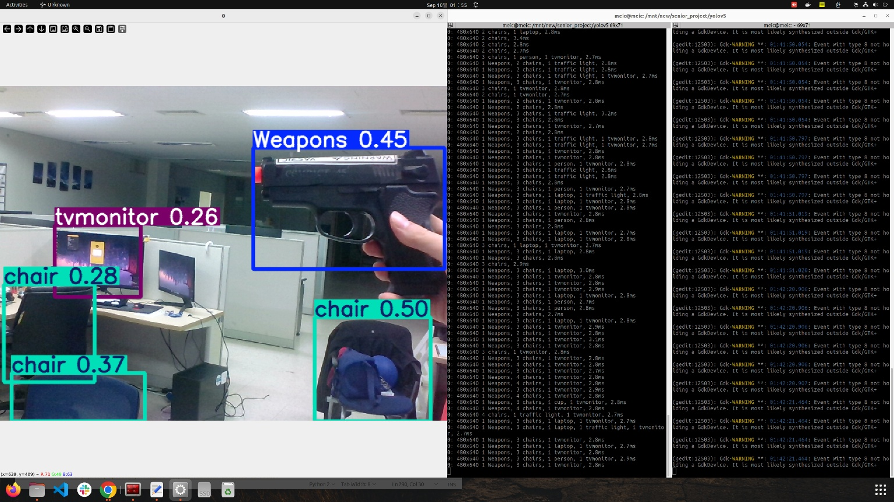
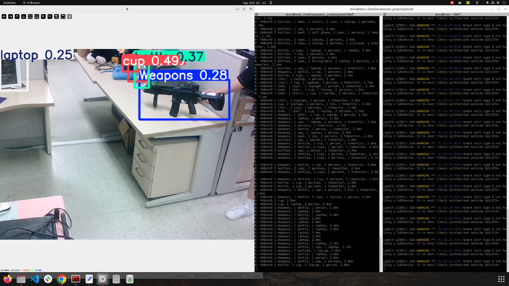
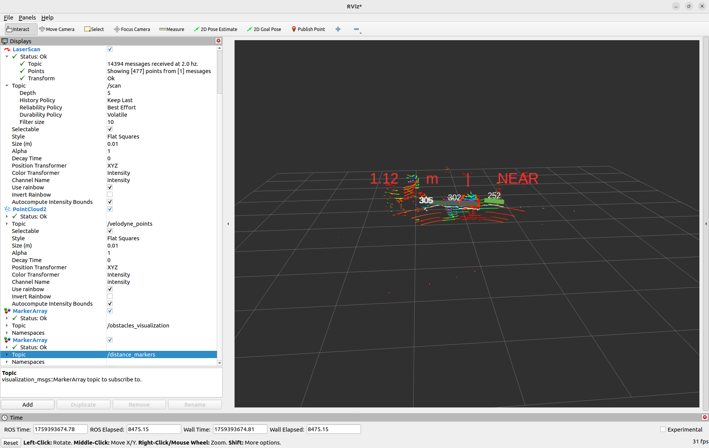
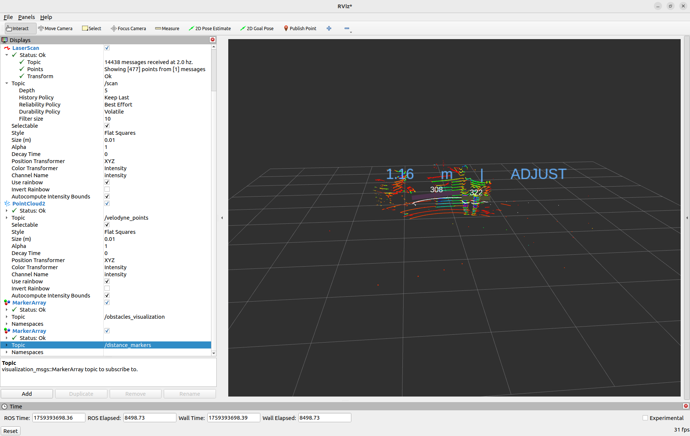
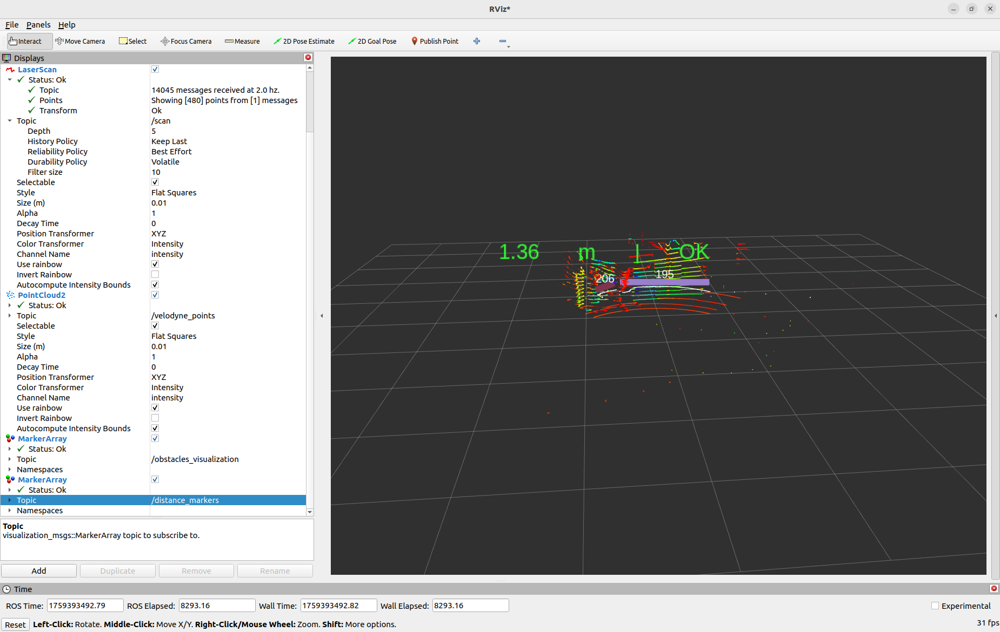

## Senior Project
--------------------
This is private back up repository for Senior project. 


## Installation
--------------------
Yolov5n: 

```bash 

# Gitclone
cd ~/senior_project 
git clone https://github.com/ultralytics/yolov5 

# Installation required libraries
cd yolov5
pip install -r requirements.txt numpy==1.24.4 # For the ROS Implementation 

# Implementation
python3 detect.py --weights ../third_party/yolov5n/yolov5n.pt --source 0 

python3 detect.py --weights ../third_party/yolov5n/best_v<version_number>.pt --source 0   
```









Obstacle_detector_2:

```bash 

# Gitclone
cd ~/senior_project/src 
git clone https://github.com/harmony-eu/obstacle_detector_2.git

# Installation required libraries
cd .. 
rosdep install --from-paths src --ignore-src -r -y 
colcon build
source ~/senior_project/install/setup.bash
```









## Documentation  
--------------------
Yolov5n:

 
Initial version is best.pt_v0.

best.pt_v1 is the version with --epoch 200 and freeze 10.


For the yolov8n:


Inside the ~/senior_project


```bash

python3 detect_v8.py
```


Obstacle_detector_2:


```bash 
ros2 run robot_brain relay_qos

ros2 launch obstacle_detector obstacle_extractor_and_tracker_2D.launch

ros2 launch velodyne_driver velodyne_driver_node-VLP16-launch.py 

ros2 launch velodyne_pointcloud velodyne_transform_node-VLP16-launch.py

ros2 run robot_brain distance_keeper 

rviz2 # Reliability Policy (Qos for scan 2D) : Realiable > Best Effort 
```


VLP16 velodyne specification:

Ip : 192.168.1.201 

500 rpm, 320 ~ 40 (degree)

## Details 
-------------------- 

Revised or made python scripts for YOLO is in third_party/yolov5n foler. 
